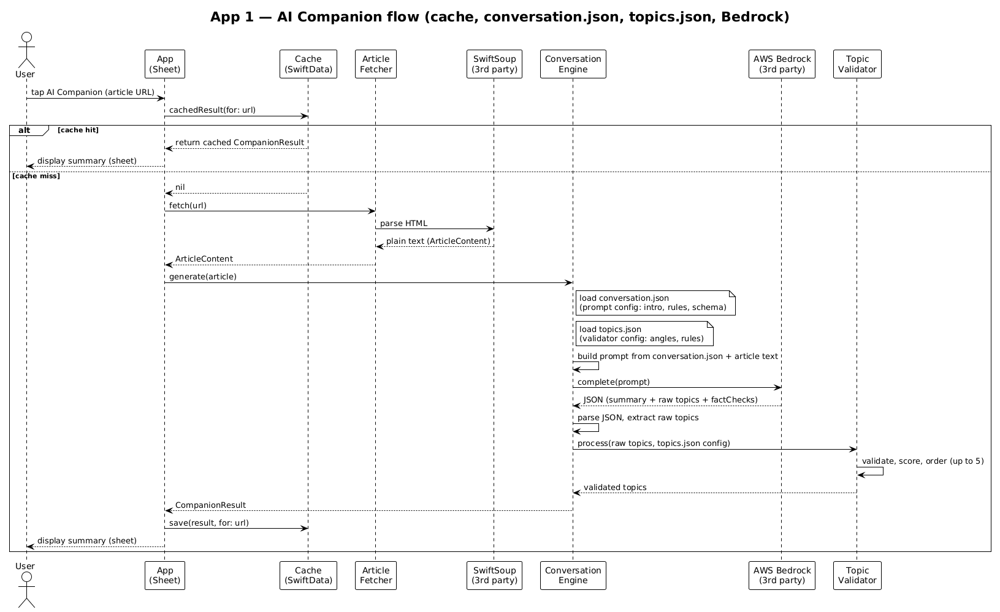
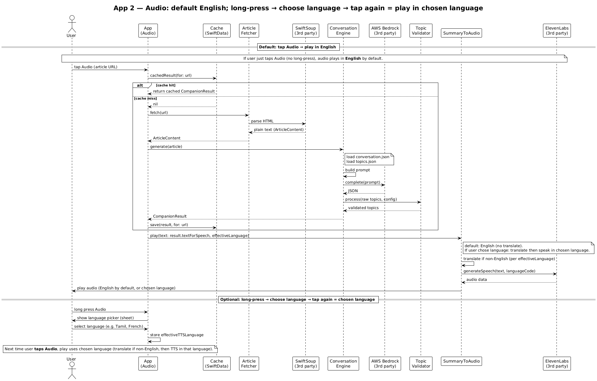

# AINewsCompanion

AI-powered companion for news articles: one-line summary, bullets, “why it matters,” and tappable topic chips. Built as a Swift package (**NewsCompanionKit**) with optional bottom-sheet UI.

## NewsCompanionKit

When the user opens the companion for an article, the app shows:

- One-line summary  
- 3–5 bullet points  
- Why the story matters  
- Tappable topic chips (e.g. “What happens next?”, “Key players”) with short summaries on tap  

**Requirements:** An API key for at least one supported provider. Default is **Groq**; others include Gemini, Claude, OpenAI, and Hugging Face. Keys are supplied via your app (e.g. `ApiKeys.xcconfig` → Info.plist); see Sample App below.

### Quick start

```swift
import SwiftUI
import NewsCompanionKit

// Config with API key (e.g. from Bundle) and optional provider.
let config = NewsCompanionKit.Config(
    apiKey: "YOUR_API_KEY",
    provider: .groq  // or .gemini, .claude, .openAI, .huggingFace
)

// Present companion sheet when user taps an article:
.companionSheet(url: $companionURL, config: config)
.presentationDetents([.medium, .large])
```

Or generate insights only: `let result = try await NewsCompanionKit.generate(url: url, config: config)`.

### Cloud clients (Azure, AWS, Google Cloud)

Article-to-summary clients for your own cloud models live in `Sources/NewsCompanionKit/CloudClients/`:

| Client | Purpose | Pass your model via |
|--------|--------|----------------------|
| **AzureOpenAIClient** | Azure OpenAI deployments | `Config(..., provider: .azureOpenAI, model: "your-deployment", azureEndpoint: "https://your-resource.openai.azure.com", ...)` |
| **AWSBedrockClient** | AWS Bedrock or custom proxy | `Config(..., provider: .awsBedrock, model: "meta.llama3-2-3b-instruct-v1:0", awsRegion: "us-east-1" or awsEndpoint: "https://...", ...)` |
| **GoogleCloudVertexClient** | Vertex AI | `Config(..., provider: .googleCloudVertex, model: "gemini-1.5-flash", gcpProject: "...", gcpLocation: "us-central1", ...)` |

You can create and use these clients without a key for local validation; add your API key and endpoint when ready. All conform to `AICompleting` and return the same JSON summary format.

**AWS Bedrock (Llama 3.2 3B):** Default model is `meta.llama3-2-3b-instruct-v1:0`. The client supports both Meta Llama 3.x (InvokeModel `prompt` / `generation`) and Anthropic Claude (message format). **Keys/credentials:** Direct Bedrock uses **IAM** (no single API key); you must sign requests with AWS SigV4 (e.g. use [AWS SDK for Swift](https://docs.aws.amazon.com/bedrock/latest/userguide/service_code_examples.html) or run behind a proxy). If you use a **proxy** that accepts an API key, set `Config.apiKey` to the proxy key and `Config.awsEndpoint` to the proxy URL. SampleApp reads `AWS_BEDROCK_ACCESS_KEY` (proxy key or leave empty for SDK/signing), `AWS_REGION` (e.g. `us-east-1`), and optional `AWS_ENDPOINT` / `AWS_MODEL_ID` from Info.plist.

**Optional headers:** When your endpoint requires extra HTTP headers (e.g. Azure `x-ms-tenant-id`, custom auth, or tracing headers), pass them via `Config.additionalHeaders` or the client initializers:

```swift
// Via Config (used by makeAIClient for all cloud providers)
var config = NewsCompanionKit.Config(
    apiKey: key,
    provider: .azureOpenAI,
    model: "gpt-4o-mini",
    azureEndpoint: "https://your-resource.openai.azure.com",
    additionalHeaders: ["x-ms-tenant-id": "your-tenant-id"]
)

// Or when creating a client directly
let client = AzureOpenAIClient(
    endpoint: "https://your-resource.openai.azure.com",
    deployment: "gpt-4o-mini",
    apiKey: key,
    additionalHeaders: ["X-Custom-Header": "value"]
)
```

Headers are applied after the default ones (Content-Type, api-key, etc.), so you can override defaults if needed.

### Translation (TranslationClients)

Separate Swift package **TranslationClients** provides text translation (e.g. English → Tamil) via **AWS Translate**, **Azure Translator**, or **Google Cloud Translation**. Use it when you need to translate companion or TTS text to another language.

| Provider | Client | Config / auth |
|----------|--------|----------------|
| **AWS Translate** | `AWSTranslateClient` | `endpoint` (or `region`) + optional `apiKey` for proxy; direct AWS requires SigV4 via `additionalHeaders`. |
| **Azure Translator** | `AzureTranslatorClient` | `subscriptionKey` + `subscriptionRegion` (Cognitive Services). |
| **Google Cloud Translation** | `GoogleCloudTranslateClient` | `apiKey` (Translation API), or proxy / Bearer via `additionalHeaders`. |

```swift
import TranslationClients

var config = TranslationConfig(
    provider: .googleCloud,  // or .aws, .azure
    googleApiKey: "YOUR_GOOGLE_API_KEY"
)
let translated = try await TranslationClients.translate(
    text: "Hello, world",
    sourceLanguageCode: "en",
    targetLanguageCode: "ta",
    config: config
)
```

Or create a client and call `translate(text:sourceLanguageCode:targetLanguageCode:)` directly. All clients conform to `TextTranslating`.

**Length limits and chunking**  
Long text is chunked automatically so you can pass arbitrarily long strings:
- **AWS Translate**: 9,000 UTF-8 bytes per request (API limit 10,000). Chunks are rejoined with a space.
- **Azure Translator**: 25,000 characters per request. Chunking prefers sentence/word boundaries.
- **Google Cloud Translation**: 5,000 characters per request. Same boundary rules.

**Prompt-based translation (translation.json)**
For production-grade, instruction-following translation (preserve placeholders, formatting, etc.), use the prompt in **`Sources/TranslationClients/Resources/translation.json`** with an LLM. The prompt is **loaded at the start of each `translate()` call** (no caching), so edits to the JSON are picked up on the next request. Set `usePromptBasedTranslation: true` and pass a `promptCompleter`. Easiest: use **`ClosureTranslationPromptCompleter`** with any client that has `complete(prompt:)` (e.g. NewsCompanionKit’s Bedrock, Azure OpenAI, or Vertex client):

```swift
import TranslationClients
import NewsCompanionKit

let aiClient = /* e.g. AzureOpenAIClient(...) or AWSBedrockClient(...) */
var config = TranslationConfig(
    provider: .azure,
    usePromptBasedTranslation: true,
    promptCompleter: ClosureTranslationPromptCompleter { try await aiClient.complete(prompt: $0) }
)
let client = TranslationClients.makeClient(config: config)
let translated = try await client.translate(text: "Hello", sourceLanguageCode: "en", targetLanguageCode: "ta")
```

The LLM must return JSON with `translated_text`. Markdown-wrapped JSON (e.g. ` ```json ... ``` `) is stripped before parsing.

### Features

- **Multi-provider**: Groq (default), Gemini, Claude, OpenAI, Hugging Face, **Azure OpenAI**, **AWS Bedrock**, **Google Cloud Vertex** via a single `Config`. Pass your cloud endpoint and model name to use your server’s available model.
- **Structured output**: Summary, bullets, “why it matters,” and up to 5 validated topic chips (title, prompt, summary).
- **Topic validation**: Angle-tag dedup, ordering, and scoring driven by `topics.json`; no filler chips when the model returns fewer valid topics.
- **Caching**: Optional SwiftData cache to avoid repeated API calls for the same URL.
- **Bottom sheet**: SwiftUI modifier and view for sheet presentation.

---

## Requirements

- iOS 17.0+
- Xcode 14+
- Swift 5.9+

## Testing

Run tests in **Xcode with the iOS Simulator** as the run destination. macOS is not required for testing the app or TTS (SummaryToAudio). From the command line, `swift test` runs the package tests on the current platform (macOS); for full iOS behavior, use Xcode → Product → Test with an iOS Simulator selected.

## Installation

### Swift Package Manager

1. In Xcode: **File → Add Package Dependencies…**
2. Enter the repository URL (or add a **Local** path).
3. Add **NewsCompanionKit** to your app target.

Or in `Package.swift`:

```swift
dependencies: [
    .package(url: "https://github.com/your-org/AINewsCompanion.git", from: "1.0.0"),
],
targets: [
    .target(name: "YourApp", dependencies: ["NewsCompanionKit"]),
]
```

## Usage

### View modifier (recommended)

Use `.companionSheet(url:config:)` and present with bottom sheet detents:

```swift
import SwiftUI
import NewsCompanionKit

struct ContentView: View {
    @State private var companionURL: URL?
    private var config: NewsCompanionKit.Config? {
        // Resolve API key for your chosen provider (e.g. from Bundle).
        guard let key = resolveAPIKey() else { return nil }
        return NewsCompanionKit.Config(apiKey: key, provider: .groq)
    }

    var body: some View {
        List(articles) { article in
            Button(article.title) {
                companionURL = article.url
            }
        }
        .companionSheet(url: $companionURL, config: config)
        .presentationDetents([.medium, .large])
    }
}
```

### Programmatic API

- **`NewsCompanionKit.generate(url:config:) async throws -> CompanionResult`**  
  Fetches the URL, extracts article text, calls the configured AI provider, and returns a structured result (summary, topics, fact checks). Use for custom UI or caching.

- **`NewsCompanionKit.resultFetcher(config:cache:) -> (URL) async throws -> CompanionResult`**  
  Returns a closure that gets a result for a URL (from optional cache or by calling `generate`). Use in App 2 (audio-only) with `result.textForSpeech` and `SummaryToAudio.shared.play(text:...)`. Cache is optional; implement `CompanionResultCaching` or pass `nil`.

- **`CompanionSheetView(result:loading:error:onTopicTap:onTelemetry:)`**  
  SwiftUI view that displays the companion result (or loading/error). Used by the modifier; use directly if you manage state yourself.

- **`Config(apiKey:provider:model:articleFetcher:timeout:maxArticleLength:debugLog:azureEndpoint:awsRegion:awsEndpoint:gcpProject:gcpLocation:additionalHeaders:)`**  
  Configuration for the AI client: key, provider, optional model override, timeout, optional debug logging. For cloud providers: `azureEndpoint`, `awsRegion`/`awsEndpoint`, `gcpProject`/`gcpLocation`. Optional `additionalHeaders` for extra HTTP headers (Azure, AWS, Google Cloud only).

## Sample App

The **SampleApp** demonstrates NewsCompanionKit with a list of sample articles and provider selection:

1. Open `SampleApp/SampleApp.xcodeproj` in Xcode.
2. Copy `SampleApp/ApiKeys.xcconfig.example` to `ApiKeys.xcconfig` and add your API keys (e.g. `GROQ_API_KEY = "your-groq-key"`). The project injects these into Info.plist at build time.
3. Run the app, pick a provider (default: Groq), then use the **App 1** and **App 2** tabs to verify each flow: **App 1** — tap **AI Companion** to open the summary sheet (no audio); **App 2** — tap **Audio** to fetch summary and play TTS (no sheet). For Azure/AWS/Google Cloud, if your endpoint requires extra HTTP headers, set them when building `Config` (e.g. `Config(..., additionalHeaders: ["x-ms-tenant-id": "your-tenant"])`).

## Two app scenarios

| App | Behavior | What to use |
|-----|----------|-------------|
| **App 1** | Show summary in a **sheet** (user reads). | **NewsCompanionKit** only. Present `CompanionSheetView` or `.companionSheet(url:config:)`. No SummaryToAudio. |
| **App 2** | **Play audio only** — no summary sheet. | **NewsCompanionKit** + **SummaryToAudio**. Use `resultFetcher(config:cache:)` (cache optional), then `result.textForSpeech` → `SummaryToAudio.shared.play(text:effectiveLanguage:textIsAlreadyTranslated:)`. |

- **App 1**: User taps → sheet opens → summary shown. No audio.
- **App 2**: User taps play → get result (from cache or fetch) → `result.textForSpeech` → audio plays. No sheet.

---

## Public API contract (App 1 and App 2)

Use this as the implementation reference for each app. Follow the contract and sample code so behavior stays consistent.

### App 1 — Summary only (sheet)

**Dependencies:** **NewsCompanionKit** only. Do not add SummaryToAudio.

**Contract:**

| What | API |
|------|-----|
| Config | `NewsCompanionKit.Config(apiKey:provider:...)` |
| Show summary | `CompanionSheetView(url:config:generateCompanion:onDismiss:onCompanionLoaded:)` or `.companionSheet(url:config:)` |
| Optional: cache-first fetch | In `generateCompanion`, return cached result if valid, else `NewsCompanionKit.generate(url:url, config:config)` |
| Optional: persist when loaded | In `onCompanionLoaded`, save the `CompanionResult` (e.g. to your cache by URL) |

**Flow:** User taps row → set URL → present sheet. Sheet loads (cache or generate) → show summary. No audio.

**Sample code (App 1):**

```swift
import SwiftUI
import NewsCompanionKit

struct App1CompanionView: View {
    @State private var companionURL: URL?  // URL to show in sheet
    private let config: NewsCompanionKit.Config  // from your app (e.g. API key + provider)

    var body: some View {
        List(articles) { article in
            Button(article.title) {
                companionURL = article.url
            }
        }
        .sheet(item: Binding(
            get: { companionURL.map { IdentifiableURL(url: $0) } },
            set: { companionURL = $0?.url }
        )) { item in
            CompanionSheetView(
                url: item.url,
                config: config,
                generateCompanion: { url in
                    // Optional: return cached result if you have one, else fetch
                    if let cached = myCache.cachedResult(for: url) { return cached }
                    return try await NewsCompanionKit.generate(url: url, config: config)
                },
                onDismiss: { companionURL = nil },
                onCompanionLoaded: { result in
                    myCache.save(result: result, for: item.url)
                }
            )
        }
    }
}

private struct IdentifiableURL: Identifiable {
    let url: URL
    var id: String { url.absoluteString }
}

// If you don't use a cache, omit generateCompanion and onCompanionLoaded:
// CompanionSheetView(url: item.url, config: config, onDismiss: { companionURL = nil })
```

---

### App 2 — Audio only (no sheet)

**Dependencies:** **NewsCompanionKit** + **SummaryToAudio**.

**Contract:**

| What | API |
|------|-----|
| Config | `NewsCompanionKit.Config(apiKey:provider:...)` |
| Get result for URL | `NewsCompanionKit.resultFetcher(config:cache:)` → call returned closure with `url` |
| Text for TTS | `CompanionResult.textForSpeech` |
| Play audio | `SummaryToAudio.shared.configure(...)` once; then `SummaryToAudio.shared.play(text:effectiveLanguage:textIsAlreadyTranslated:)` |
| Optional: cache | Implement `NewsCompanionKit.CompanionResultCaching` and pass to `resultFetcher(config:cache:)`; or pass `nil` |

**Flow:** User taps play → get result (cache or `resultFetcher`) → `result.textForSpeech` → `play(text:...)`. No sheet.

**Sample code (App 2):**

```swift
import SwiftUI
import NewsCompanionKit
import SummaryToAudio

struct App2AudioView: View {
    private let config: NewsCompanionKit.Config  // from your app
    private let cache: (any NewsCompanionKit.CompanionResultCaching)?  // or nil for no cache

    var body: some View {
        List(articles) { article in
            HStack {
                Text(article.title)
                Spacer()
                Button("Play") {
                    Task { await playSummary(for: article.url) }
                }
            }
        }
        .onAppear {
            SummaryToAudio.shared.configure(
                provider: .elevenLabs,
                elevenLabsKey: yourElevenLabsKey  // or sarvamKey for Sarvam
            )
        }
    }

    private func playSummary(for url: URL) async {
        let fetch = NewsCompanionKit.resultFetcher(config: config, cache: cache)
        do {
            let result = try await fetch(url)
            await SummaryToAudio.shared.play(
                text: result.textForSpeech,
                effectiveLanguage: .elevenLabs(.english),  // or .sarvam(.tamil), etc.
                textIsAlreadyTranslated: false
            )
        } catch {
            // show error
        }
    }
}
```

**Minimal App 2 (English only, no cache):** Omit cache and use `resultFetcher(config: config, cache: nil)`. Add loading state and translation only if you need them.

---

### Quick reference

| App | Entry point | No sheet? | No audio? |
|-----|-------------|-----------|-----------|
| App 1 | `CompanionSheetView` or `.companionSheet(url:config:)` | — | ✓ |
| App 2 | `resultFetcher(config:cache:)` → `result.textForSpeech` → `SummaryToAudio.shared.play(...)` | ✓ | — |

**Design notes:** Two entry points (sheet vs fetch+play) keep App 1 and App 2 independent. Config and optional cache are injected so you can test or swap providers/storage. `CompanionResultCaching` keeps the library storage-agnostic; `textForSpeech` is the single source for TTS text.

## SummaryToAudio & TTS

The sample app can speak the companion summary via **ElevenLabs** or **Sarvam AI**.

### Flow (ElevenLabs with a non-English language)

1. **English input** – Summary text from the companion (one-liner + bullets + why it matters).
2. **Translate** – If the selected language is not English, text is translated using:
   - **LibreTranslate** when `LIBRETRANSLATE_URL` (and optionally `LIBRETRANSLATE_API_KEY`) is set in your config.
   - **MyMemory** (free, no key) otherwise; long text is chunked and translated in segments.
   - Or an app-provided translator (e.g. AI) via `setElevenLabsTranslator(_:)`.
3. **ElevenLabs TTS** – Translated (or original) text is sent to ElevenLabs with the chosen `language_code` (e.g. `fr`, `de`, `ja`). The model used is `eleven_multilingual_v2`.
4. **Play** – The returned audio is played in the app. Translations are cached per URL + language.

### ElevenLabs languages (29)

English, Arabic, Bulgarian, Chinese, Croatian, Czech, Danish, Dutch, Filipino, Finnish, French, German, Greek, Hindi, Indonesian, Italian, Japanese, Korean, Malay, Polish, Portuguese, Romanian, Russian, Slovak, Spanish, Swedish, Tamil, Turkish, Ukrainian.

### Sarvam vs ElevenLabs (English and non-English)

Same flow shape for both providers; only the translation source and cache keys differ.

| Aspect | Sarvam | ElevenLabs |
|--------|--------|------------|
| **English** | No translation; cache key `en-IN`; TTS via Sarvam. | No translation; cache key `en`; TTS via ElevenLabs. |
| **Non-English** | Translation: **Sarvam API only** (`sarvamClient.translate`). Cache keys: `ta-IN`, `hi-IN`, `te-IN`, `ml-IN`, `gu-IN`. TTS: Sarvam. | Translation: **Translation API** (LibreTranslate / MyMemory) or custom translator. Cache keys: `fr`, `de`, `ta`, `hi`, etc. (29 langs). TTS: ElevenLabs. |
| **Stale cache** | If cached text equals source (untranslated), entry is deleted and not used. | Same. |
| **Translation failure** | Fallback: cached English (`en-IN`) or source text; play in English. | Fallback: cached English (`en`) or source text; play in English. |

Sarvam and ElevenLabs are decoupled: removing one does not require changes in the other’s client or translation path.

### Optional config

- **LibreTranslate**: In `ApiKeys.xcconfig` (or Info.plist), set `LIBRETRANSLATE_URL` (e.g. `https://libretranslate.com`) and optionally `LIBRETRANSLATE_API_KEY` for better translation quality and no chunking.
- **Translation failure**: If translation fails (e.g. network), the user sees “Translation failed. Playing in English.” and the original English is spoken.

## How it works

1. The library fetches the article URL with `URLSession`.
2. HTML is parsed with [SwiftSoup](https://github.com/scinfu/SwiftSoup); article content is taken from `<article>`, `<main>`, `[role=main]`, or common content classes, then stripped to plain text.
3. A prompt is built from `conversation.json` (and article text); the configured AI provider returns structured JSON (summary, topics, fact checks).
4. Topics are validated and ordered via `TopicValidator` using rules in `topics.json` (angles, blocklists, scoring, priority). Only validated chips are shown (1–5); no filler templates.
5. The result is shown in the companion sheet (or returned from `generate` for custom use). Optional SwiftData cache stores results by URL to reduce API calls.

### High-level architecture

**App 1 — AI Companion (summary sheet)**  
When the user taps the AI Companion button in App 1, the flow is: **URL → cache check** → on miss: **ArticleFetcher (SwiftSoup: HTML→text) → ConversationEngine** (loads `conversation.json` and `topics.json`) **→ AWS Bedrock (Nova Micro v1)** → **TopicValidator** (using `topics.json`) → **CompanionResult** → summary shown in the sheet.



**App 2 — Audio (default English; long-press to choose language)**  
Default: tap Audio → play in English. Optional: long-press → choose language → tap Audio again → play in chosen language (translate if non-English, then ElevenLabs TTS). Uses cache, Bedrock for summary, then Summary To Audio and ElevenLabs for playback.



**PlantUML sequence diagrams**

| App | PlantUML source | Flow |
|-----|-----------------|------|
| **App 1** | [docs/sequence-diagram-summary.puml](docs/sequence-diagram-summary.puml) | Tap AI Companion → cache check → on miss: fetch article, load conversation.json + topics.json, AWS Bedrock, TopicValidator → save & display summary in sheet. Third-party: SwiftSoup, AWS Bedrock. |
| **App 2** | [docs/sequence-diagram-audio.puml](docs/sequence-diagram-audio.puml) | Default: tap Audio → play in English. Optional: long-press → choose language → tap Audio again → play in chosen language (translate if non-English, then ElevenLabs TTS). Cache, Bedrock, Summary To Audio. |

Re-render from repo root: `plantuml -tpng docs/sequence-diagram-summary.puml` and `plantuml -tpng docs/sequence-diagram-audio.puml` (outputs PNGs in `docs/`). Short versions: `docs/sequence-diagram-short.puml`, `docs/sequence-diagram-audio-short.puml`. Alternative: [docs/sequence-diagram.mmd](docs/sequence-diagram.mmd) (Mermaid) for App 1 — use [mermaid.live](https://mermaid.live) to render.

## Project structure

```
AINewsCompanion/
├── Package.swift
├── README.md
├── docs/
│   ├── architecture-summary.png      # High-level architecture App 1 (AI Companion flow)
│   ├── architeture-audio.png         # High-level architecture App 2 (Audio flow, language selection)
│   ├── architecture.png             # High-level architecture (App 1)
│   ├── sequence-diagram-summary.puml         # PlantUML sequence diagram App 1 (full)
│   ├── sequence-diagram-short-summary.puml   # PlantUML sequence diagram App 1 (PPT-friendly)
│   ├── sequence-diagram.mmd          # Mermaid sequence diagram App 1 (same flow as .puml)
│   ├── sequence-diagram-audio.puml   # PlantUML sequence diagram App 2 Audio (full, language selection)
│   └── sequence-diagram-short-audio.puml  # PlantUML sequence diagram App 2 (PPT-friendly)
├── topics_prompt.md
├── Sources/
│   └── NewsCompanionKit/
│       ├── Models.swift
│       ├── Protocols.swift
│       ├── ArticleFetcher.swift
│       ├── NewsCompanionKit.swift      # generate(url:config:), Config
│       ├── ConversationEngine.swift
│       ├── TopicValidator.swift
│       ├── CompanionSheetView.swift
│       ├── CompanionSheetModifier.swift
│       ├── GeminiClient.swift
│       ├── GroqClient.swift
│       ├── ClaudeClient.swift
│       ├── OpenAIClient.swift
│       ├── HuggingFaceClient.swift
│       └── Resources/
│           ├── conversation.json
│           └── topics.json
├── Tests/
│   └── NewsCompanionKitTests/
└── SampleApp/
    ├── SampleApp.xcodeproj
    └── SampleApp/
        ├── SampleAppApp.swift
        ├── ContentView.swift
        ├── CompanionDebug.swift
        └── ApiKeys.xcconfig.example
```

## Limitations

- **No WebView**: Content is extracted from HTML. JavaScript-rendered or heavily dynamic pages may not extract well.
- **Best-effort extraction**: Some sites (paywalls, complex layouts) may yield incomplete or noisy text.
- **Network**: Requires network access; ensure App Transport Security allows the URLs you use.
- **API keys**: You must supply and secure keys for your chosen provider(s); the package does not ship or store keys.

## License

Use and modify as needed for your project.
