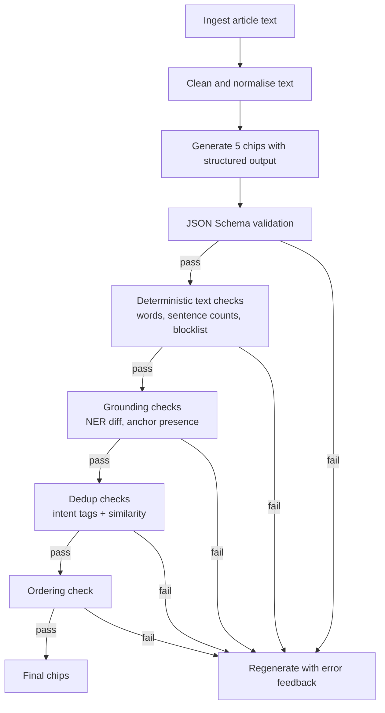

# Topic Prompt Guide

## Table of contents

- [Executive summary](#executive-summary)
- [Design principles](#design-principles-grounded-in-sources)
- [Specification](#specification-for-generating-and-validating-topic-chips)
  - [Purpose, input/output contract, field constraints](#purpose)
  - [Grounding, distinctness, ordering](#grounding-rules)
  - [Mapping: topics.json ↔ prompt and validator](#mapping-topicsjson--prompt-and-validator)
  - [Article-type adaptations, sparse-article guidance, rejection rules](#article-type-adaptations)
  - [Final generation prompt](#final-generation-prompt)
- [Validation and evaluation](#validation-and-evaluation)
- [Implementation pipeline](#implementation-pipeline)
- [Change log and confidence](#change-log-comparison-remaining-flaws-confidence)

---

## Executive summary

This document defines a production-grade, single-article topic-chip generator spec. The model is instructed to return **exactly five** candidate chips as strict JSON objects with fields `title`, `prompt`, and `summary`, while the app renders **up to five validated chips** after deterministic filtering. It is designed for UI chip surfaces where labels must be scannable, distinctive, and information-scented, while remaining grounded in the article and validated automatically. The approach combines (a) structured outputs and schema validation for format reliability, (b) explicit grounding to reduce hallucinations, and (c) operational deduplication and ordering logic to keep chips both unique and useful.

Assumptions (explicit because input details were unspecified):

- The only mandatory input is **plain article text** (`ARTICLE_TEXT`), already extracted from the publisher page, cleaned of boilerplate where possible.
- A calling system runs **deterministic validators** (`TopicValidator`) for scoring, angle-tag dedup, and ordering. Semantic dedup via embeddings is documented as a future enhancement.
- The system will treat the article as the **sole source of truth**; no web browsing, cross-article synthesis, or external fact-checking occurs in generation. (If you later add retrieval, treat it as a separate mode and update the spec accordingly.)

## Design principles grounded in sources

A production topics generator fails most often for two reasons: unreliable structure and unreliable truthfulness. Modern best practice is to constrain structure with a schema and then validate mechanically, rather than hoping the model respects free-form instructions.

For the structure layer, OpenAI’s Structured Outputs guidance explicitly recommends schema-driven outputs and warns about schema drift between code and schema, encouraging type-first schema management or CI checks to prevent divergence.

For the validation layer, JSON Schema Draft 2020-12 defines the core vocabulary used here (arrays with `minItems` and `maxItems`, objects with required fields, string constraints), and the spec-level constraints can be enforced by standard validators.

For the UX layer, chip components exist to enable selection, filtering, and quick actions in compact UI, so their labels must carry meaning out of context. This aligns with long-standing usability and accessibility guidance that discourages vague labels like “Learn more” because they have poor information scent and harm accessibility.

Sources prioritised in this design include OpenAI for structured output practices, Google Material for chip behaviour, W3C and WebAIM for concise meaningful labels, Nielsen Norman Group for scannability and writing discipline, and Anthropic for prompt-engineering clarity.

## Specification for generating and validating topic chips

### Purpose

Request **exactly five** topic chips from the model for a single news article, then display **up to five** validated chips in the app. Each chip is a follow-up conversation path that is:

- grounded in article facts only,
- distinct in intent from the other chips,
- brief enough to display as a chip title,
- specific enough that tapping it yields a meaningfully different analysis.

Chips are compact UI elements used to trigger actions or filter and guide exploration, so short, meaningful labels are a first-order product requirement.

### Input contract

- `ARTICLE_TEXT` (required): the full text of one article, ideally cleaned of site navigation, cookie banners, and unrelated footers.
- Optional internal-only metadata (not passed to users, not required): `headline`, `publisher`, `published_at`, `section`, `byline`. If provided to the model, they must be considered part of “the article” for grounding.

### Output contract

Target LLM output: return valid JSON only as an array of exactly **five** objects.

Rendered app output: after validation, deduplication, and ordering, the app may display **1 to 5** topics. It does not fabricate or fill missing chips.

Each object must have:

- `title`: short chip title (2 to 5 words; 32-character cap preferred),
- `prompt`: one-sentence follow-up question specific to that chip angle,
- `summary`: 2 to 3 sentences describing what the chip covers in the context of the article, including at least one concrete article detail when available.

### Field constraints

The table below uses “MUST” for hard requirements and “SHOULD” for soft requirements that trigger warnings, not failures.

| Field | MUST | SHOULD | Notes |
|---|---|---|---|
| `title` | 2 to 5 words; non-empty; distinct across the set | ≤ 32 characters; no vague filler | Vague labels reduce information scent and harm accessibility and usability. |
| `prompt` | exactly one sentence; directly answerable from the article context | include a concrete anchor (named actor, decision, event, number, date, place) when available | One sentence reduces ambiguity and improves consistency for downstream rendering. |
| `summary` | 2 to 3 sentences; neutral; grounded; does not repeat the title | contain at least one concrete article detail when the article contains any | Summaries improve scan behaviour and help users pick a path quickly. |

Concrete detail rule (operational): If the article contains any of the following, each summary should include at least one: a named person or organisation, a location, a number, a date or time reference, a decision, a quoted claim, or a described event. If not available, the summary must explicitly acknowledge missing detail (example: “The article does not specify the timeline.”) to avoid invention.

### Grounding rules

Grounding is non-negotiable because users need to trust outputs, and hallucinated details are a well-known failure mode for language models.

Hard grounding rules:

- Use only facts explicitly stated in the article text (and optional metadata if you include it as part of the “article input”).
- Do not invent: people, organisations, motives, outcomes, timelines, numbers, locations, quotes, causal claims, or “what happens next” specifics unless the article itself describes them.
- Preserve spelling of names, numbers, and dates exactly as in the article.
- If the article is unclear or incomplete, state that uncertainty plainly using conservative language (examples: “the article does not yet say”, “it remains unclear”).

### Distinctness and deduplication rule

Conceptual “be distinct” is not enough in production. This spec defines an operational rule that can be validated.

Definitions:

- **Intent**: the underlying analytical question the chip is asking the model to answer (for example: “summarise the event”, “identify stakeholders”, “forecast next steps described”, “explain uncertainty”, “compare arguments described”).
- **Intent overlap**: the degree to which two chips would produce substantially the same answer if a user tapped either.

Hard rule:

- No pair of chips may have **more than 50 percent intent overlap**.

How to enforce intent overlap:

**Current implementation (`TopicValidator` — angle-tag dedup)**:

1. Assign each chip an **angle tag** from a closed set defined in `topics.json`: `{recap, next, players, impact, uncertainty, timeline, debate, watchlist, other}`.
2. Classify each chip by matching title and prompt text against keyword lists in `topics.json`.
3. For each angle tag, keep only the **highest-scoring** chip; discard duplicates sharing the same angle.
4. Chips tagged `other` are exempt from dedup (they lack a canonical angle).

This deterministic keyword-based dedup is fast, predictable, and testable without external dependencies.

**Recommended future enhancement (semantic dedup)**:

For higher-fidelity dedup, optionally layer on:

1. Extract “anchors” from each chip: article-terms referenced (names, organisations, places, numbers, date tokens).
2. Compute pairwise overlap using:
   - anchor Jaccard overlap,
   - prompt semantic similarity (embedding cosine similarity, if available).
3. Fail the pair as a duplicate if either condition holds:
   - same angle tag AND anchor overlap ≥ 0.5, OR
   - embedding similarity ≥ 0.85, OR
   - prompt token Jaccard overlap (after stopword removal) ≥ 0.5.

This enhancement follows a general evaluation principle: define measurable criteria, run tests repeatedly, and track deltas.

Forbidden near-duplicate examples (must reject at least one of each pair):

| Chip A title | Chip B title | Why forbidden |
|---|---|---|
| “What happens next” | “What to watch” | Both ask for forward-looking developments, highly overlapping. |
| “Key players” | “Who is involved” | Both ask for actor identification. |
| “Timeline so far” | “How it unfolded” | Both ask for chronology recap. |
| “Why it matters” | “Impact on people” | Often duplicates unless one is explicitly limited to a named group from the article. |
| “Arguments for and against” | “Debate around it” | Both ask for pros/cons framing. |

### Ordering logic

The output order is a product decision, not a stylistic preference. Ordering should reflect what users most often need first when scanning chips: clarity on the core event, then relevance, then forward path, then deeper structure. This aligns with scannability and information scent guidance.

Default ordering priority (apply unless article-type adaptation overrides):

1. Core event or issue — angle `recap` (fast understanding chip)
2. Why it matters or who is affected — angle `impact` (relevance chip)
3. What happens next — angle `next` (only if the article supports next steps)
4. Key players and roles — angle `players` (stakeholder chip)
5. Biggest uncertainty, timeline, or arguments — angles `uncertainty`, `timeline`, `debate`, `watchlist` (depth chip)

**Implementation**: `TopicValidator.orderByPriority()` sorts the final chip set using the `anglePriority` array from `topics.json`: `[recap, impact, next, players, uncertainty, timeline, debate, watchlist, other]`. Ties within the same priority rank are broken by descending score.

### Mapping: topics.json ↔ prompt and validator

The prompt (in `conversation.json`) and the validator config (`topics.json`) are aligned so that the same angles, blocklists, and numeric constraints govern both what the model is asked to produce and what the code enforces.

| Prompt / spec concept | topics.json field | Purpose |
|---|---|---|
| "Exactly 5" model topics | `validation.maxTopics` (5) | The prompt targets 5 topics; the validator returns at most 5 valid topics. |
| "2 to 5 words" title | `validation.minTitleWords`, `validation.maxTitleWords` (2, 5) | Reject chips that are too short or long. |
| "≤ 32 characters" title | `validation.maxTitleChars` (32) | Keep chip labels scannable. |
| "One sentence" prompt (min clarity) | `validation.minPromptWords` (6), `validation.minPromptWordsForClarity` (10) | Reject overly vague prompts. |
| "No generic filler" | `fillerTitles`, `fillerPhrases` | Blocklist for titles and prompt text (e.g. "Learn more", "Deep dive", "More context"). |
| "Varied angles: what happened, what happens next, key players, uncertainties, timeline, impact, what to watch, competing arguments" | `angles` (recap, next, players, impact, uncertainty, timeline, debate, watchlist) | Classify each chip for dedup and ordering; names match prompt wording (e.g. what happened → recap, competing arguments → debate). |
| Ordering: recap → impact → next → players → depth | `anglePriority` | Order final chips for display; ties broken by score. |
| Score threshold and grounding/filler signals | `validation.minScore`, `validation.groundingKeywords`, `validation.fillerTitleWords` | Chips must have `score >= minScore` (7); scoring uses presence of grounding phrases (e.g. "article", "based on") and absence of filler words. |

Runtime scoring in `TopicValidator.computeScore()` uses: angle bonus (canonical angle vs `other`), question mark, `groundingKeywords` and `fillerTitleWords` from `validation`, and word-count bonuses. Only chips with `score >= validation.minScore` (7) pass. This is separate from the offline scoring rubric in this document (which is for manual eval and regression).

### Article-type adaptations

Adaptations must stay grounded; they change which angles you prioritise, not the grounding standard.

| Article type | Chip selection emphasis | Notes |
|---|---|---|
| Breaking news | confirmed facts, what is unknown, immediate next procedural steps, involved parties | Conservative phrasing is mandatory when details are missing.  |
| Explainer | core mechanism, why it matters, timeline/background, trade-offs described, what to watch | Avoid inventing context beyond the explainer text. |
| Politics or policy | decision/proposal, affected groups, key institutions named, procedural next steps described, uncertainties | Maintain fidelity to what the article states. |
| Business or markets | headline result, key numbers stated, drivers stated, stakeholder reactions if quoted, next steps outlined | Keep numeric fidelity. |
| Science or health | claim/finding described, evidence described, limitations/unanswered questions described, who may be affected (only if article says), what research comes next (only if article says) | Avoid oversimplified certainty.  |
| Sport | result, turning point, standout performance, implications described, next fixture described | Do not invent schedule or standings. |

### Short or truncated article guidance

If the article appears truncated, very short, or incomplete, the model should still aim for five candidate chips without adding generic filler. After validation, the app may show fewer than five if not enough candidates are valid.

Operational definition (recommended):

- Truncated if any is true:
 - fewer than 3 complete sentences after cleaning, OR
 - obvious cut-off indicators in text (“…”, abrupt end), OR
 - missing key fields the article references (“details to follow”, “developing story”) without providing them.

Preferred sparse-article angles:

- Keep candidate chips tightly scoped to what is explicitly present:
 - “What we know”
 - “What is unclear”
 - “Who is named”
 - “Key numbers stated” (only if numbers exist)
 - “Next steps mentioned” (only if next steps are mentioned; otherwise use “Questions raised”)

Each such chip must explicitly acknowledge missing detail in `summary` where applicable, rather than inferring.

### Hard rejection rules

Reject and regenerate if any of the following occurs:

- The model output does not contain exactly five items.
- Not valid JSON.
- Any missing field among `title`, `prompt`, `summary`.
- Any extra unexpected fields (unless you intentionally allow them, which this spec does not).
- Any `title` not 2 to 5 words.
- Any `prompt` not exactly one sentence.
- Any `summary` not 2 to 3 sentences.
- Any chip uses generic filler labels (examples: “Learn more”, “More context”, “Deep dive”).
- Any pair violates the >50 percent intent-overlap rule.
- Any chip introduces factual claims not supported by the article.

The rationale for rejecting vague, low-information labels is supported by usability and accessibility guidance discouraging filler link text because it reduces information scent and harms users who scan information out of context.

### Final generation prompt

Use this prompt verbatim in your generation call, with structured-output enforcement if your platform supports it.

```text
SYSTEM / DEVELOPER INSTRUCTIONS:

You generate topic chips from a single news article.

Output rules:
- Return valid JSON only.
- Return an array of exactly 5 candidate objects.
- Each object MUST have exactly these keys: title, prompt, summary.

Field rules:
- title: 2 to 5 words, concise chip label; avoid vague filler like "Learn more".
- prompt: exactly one sentence; a specific follow-up question for analysis of that chip angle.
- summary: 2 to 3 sentences; neutral and factual; describe what the chip covers in the context of the article.
- If the article contains concrete details (names, places, dates, numbers, decisions, events), each summary must include at least one such detail.
- Do not repeat the title in the summary.

Grounding rules:
- Use only the article text as the source of truth.
- Do not invent people, organisations, motives, outcomes, timelines, numbers, locations, or quotes.
- Preserve names, numbers, and dates exactly as in the article.
- If the article does not specify something, say so explicitly (for example: "the article does not yet say").

Distinctness rules:
- Chips must be meaningfully different in intent.
- Reject near-duplicates (for example: "What happens next" vs "What to watch").
- No pair of chips may have more than 50% overlap in intent.

Ordering rules (default):
1) Core event or issue
2) Why it matters or who is affected
3) Next steps mentioned (only if the article mentions them)
4) Key players named
5) Biggest uncertainty, timeline, or arguments described

ARTICLE TEXT:
{{ARTICLE_TEXT}}
```

## Validation and evaluation

### Validator checklist

JSON Schema alone cannot reliably enforce “one sentence” or “2 to 3 sentences” across all punctuation styles, so production validation should combine JSON Schema with deterministic text checks and, optionally, semantic checks. Ajv and python-jsonschema both support extensibility for additional constraints.

Checklist (treated as MUST unless marked SHOULD). **Current implementation**: `TopicValidator` plus the parse layer enforce title words/chars/blocklist, prompt min words, angle-tag dedup, and ordering via `topics.json`. Sentence-count and NER checks are not yet implemented (see remaining flaws). The app may return 1 to 5 validated topics.

| Category | Check | Severity | Implemented in code |
|---|---|---|---|
| Structure | Output parses as JSON | MUST | Yes (parse layer) |
| Structure | Model output top-level is array of length 5 | MUST | No (prompt/schema target only) |
| Structure | Each item is object with only keys `title`, `prompt`, `summary` | MUST | Yes (decode + pass-through) |
| Title | 2 to 5 words (tokenise on whitespace) | MUST | Yes (`minTitleWords`, `maxTitleWords` in topics.json) |
| Title | Not in blocklist of vague labels | MUST | Yes (`fillerTitles` in topics.json) |
| Title | ≤ 32 characters | SHOULD (warn) | Yes (`maxTitleChars` in topics.json) |
| Prompt | Exactly one sentence (heuristic) | MUST | No (only min word count; sentence heuristic is future) |
| Prompt | Contains at least one article anchor when anchors exist | SHOULD (warn) | No |
| Summary | 2 to 3 sentences (sentence splitter) | MUST | No (presence only; sentence count is future) |
| Summary | Contains at least one concrete article detail if article contains any | MUST | No (prompt-level only) |
| Grounding | No named entities absent from article (NER diff) | MUST if feasible | No (aspirational) |
| Dedup | Angle-tag dedup: one chip per canonical angle | MUST | Yes (`deduplicateByAngle` using topics.json angles) |
| Ordering | Matches ordering policy | MUST | Yes (`orderByPriority` using `anglePriority` in topics.json) |

### Machine-readable JSON Schema

This schema targets JSON Schema Draft 2020-12.

```json
{
 "$schema": "https://json-schema.org/draft/2020-12/schema",
 "$id": "https://example.com/schemas/topic-chips.schema.json",
 "title": "TopicChips",
 "type": "array",
 "minItems": 5,
 "maxItems": 5,
 "items": {
 "type": "object",
 "additionalProperties": false,
 "required": ["title", "prompt", "summary"],
 "properties": {
 "title": {
 "type": "string",
 "minLength": 2,
 "maxLength": 64,
 "pattern": "^[^\\s]+(\\s+[^\\s]+){1,4}$",
 "description": "2-5 words. Prefer <= 32 characters (soft constraint validated outside JSON Schema)."
 },
 "prompt": {
 "type": "string",
 "minLength": 5,
 "maxLength": 240,
 "pattern": "^(?!.*\\n).+$",
 "description": "One sentence follow-up question. Sentence count validated outside JSON Schema."
 },
 "summary": {
 "type": "string",
 "minLength": 20,
 "maxLength": 600,
 "pattern": "^(?!.*\\n).+$",
 "description": "2-3 sentences. Sentence count and presence of article detail validated outside JSON Schema."
 }
 }
 }
}
```

Notes on limitations (deliberate design choice):

- JSON Schema does not robustly enforce sentence counts across languages and punctuation conventions, so this schema enforces structure and basic string constraints; sentence-count checks belong in the validator layer. Ajv supports custom keywords for stronger validation; python-jsonschema exposes validator extension points similarly.

Recommended validator settings (example rationale):

- Enable “report all errors” so you can show a complete failure report in logs.
- Use strict schema and strict evaluation modes where feasible to surface mistakes early.

### Offline scoring rubric

This rubric supports regression testing and prompt iteration. It follows evaluation best practice: define measurable criteria, run tests repeatedly, track deltas, and avoid relying solely on anecdotal spot checks.

Weighted rubric (0 to 2 points per dimension, total 20):

| Dimension | Weight | 0 points | 1 point | 2 points |
|---|---:|---|---|---|
| JSON validity | 2 | invalid JSON | valid but violates schema | valid and schema-pass |
| Count correctness (model output) | 2 | not 5 | 5 but missing fields | exactly 5 with correct fields |
| Grounding fidelity | 4 | invented facts/entities | minor unsupported inference | fully grounded, uncertainties stated |
| Title quality | 2 | vague/long/duplicative | usable but weak scent | concise, distinct, high scent |
| Prompt specificity | 2 | generic | somewhat article-tied | clearly anchored to article details |
| Summary usefulness | 2 | generic | partial detail | crisp 2-3 sentences with concrete detail |
| Distinctness | 4 | heavy duplication | mild overlap | clearly distinct intents, operationally deduped |
| Ordering | 2 | random | partially aligned | aligns to ordering strategy |

Pass thresholds (recommendation):

- Ship gate: average ≥ 16/20 and no hard-rule failures (grounding, schema, duplicates).
- Monitor: track per-article-type breakdown to identify drift.

## Implementation pipeline

### Pipeline flow

Structured prompting reduces format errors, but production reliability comes from a pipeline that validates and repairs outputs deterministically.

**Current implementation (code)**: Ingest article → build prompt from `conversation.json` → AI generates JSON → parse JSON → raw chips passed to `TopicValidator.process()` which: applies deterministic checks from `topics.json` (title/prompt words and chars, blocklists, min score), deduplicates by angle, trims to `maxTopics`, then orders by `anglePriority` → final app output of up to 5 validated chips. No JSON Schema or NER step in code; those are aspirational.

**Aspirational pipeline** (for future tooling; diagram below):



### Brief implementation checklist

A minimal production checklist emphasises schema enforcement, validation, and regression testing.

| Step | Outcome | Source rationale |
|---|---|---|
| Use structured outputs (schema-constrained) | reduces parsing drift |  |
| Validate with JSON Schema Draft 2020-12 | catches structural failures |  |
| Add deterministic checks | enforces sentence and word constraints |  |
| Add dedup logic | prevents near-duplicate chips |  |
| Maintain schema as code | avoids divergence |  |
| Build an eval set | prevents regressions |  |

## Change log, comparison, remaining flaws, confidence

### Comparison table old vs updated rules

The “old” column summarises the prior spec you supplied (notably: variable count, schema ambiguity, and missing operational validators). The “updated” column reflects this document.

| Area | Prior spec | Updated production rule | Why it matters |
|---|---|---|---|
| Output count | “exactly 5 or 6” | model target: exactly 5; app output: up to 5 validated topics | Stable UI layout while avoiding fabricated filler chips.  |
| Schema | sample omitted `summary` | final schema includes `title`, `prompt`, `summary` only | Prevents schema drift and missing fields.  |
| Title length | 2 to 5 words; 32-char cap mentioned | 2 to 5 words enforced; 32 chars preferred as warning | Chips are compact; short labels improve scan.  |
| Prompt constraint | one sentence | one sentence (prompt-level); code enforces min word count via `topics.json` validation | Reduces ambiguity and improves consistency.  |
| Summary constraint | 2 to 3 sentences | 2 to 3 sentences plus concrete detail when available (prompt-level); code preserves non-empty summary | Forces article-specific usefulness; reduces generic filler.  |
| Dedup | “avoid repeating the same angle” | Angle-tag dedup in `TopicValidator` (one chip per angle from `topics.json`); >50% overlap is spec rule for prompt; semantic dedup is future enhancement | Prevents near-duplicate chips systematically.  |
| Ordering | not defined | defined priority order enforced by `TopicValidator.orderByPriority` via `anglePriority` in `topics.json` | Produces predictable, user-first chip sets.  |
| Tooling | none | JSON Schema + validator checklist + offline rubric | Moves from prompt-only hope to testable system.  |

### Change log from the prior spec

- Fixed the model target to **exactly five** candidates and aligned schema to enforce it mechanically via `minItems=maxItems=5`, while the app now renders only the validated subset (up to 5).
- Resolved schema ambiguity by making `summary` a first-class required field and forbidding additional properties.
- Upgraded “distinctness” from a guideline to an operational dedup rule (angle-tag dedup in `TopicValidator` (driven by `topics.json` angles); semantic dedup documented as future enhancement).
- Added ordering logic enforced by `TopicValidator.orderByPriority` using `anglePriority` from `topics.json`, plus article-type adaptation tables to stabilise UX.
- Added sparse-article guidance that remains grounded and explicitly acknowledges unknowns rather than inventing detail.
- Added validator checklist, machine-readable JSON Schema, offline scoring rubric, and pipeline diagram to support continuous testing and regression prevention.

### Example output

Hypothetical article (for demonstration only):

- The article reports that “Riverton City Council” approved a “£120 million” flood-defence plan on “7 March 2026”, citing “two severe floods in 2024”. The plan includes “river wall upgrades” and “early-warning sirens”, and the article notes that funding sources and construction start date are not yet specified.

Example JSON output (valid under this spec):

```json
[
 {
 "title": "What happened today",
 "prompt": "Based only on the article, what decision did Riverton City Council make and what does it include?",
 "summary": "This topic focuses on the council approval reported in the article and what the £120 million flood-defence plan covers. It stays anchored to the measures mentioned, such as river wall upgrades and early-warning sirens."
 },
 {
 "title": "Why it matters",
 "prompt": "According to the article, what problem is the £120 million plan responding to and why is it being prioritised now?",
 "summary": "This topic examines the rationale the article gives for the plan, including the reference to two severe floods in 2024. It frames the significance in terms of the risks and pressures the article describes, without adding unstated impacts."
 },
 {
 "title": "Key players named",
 "prompt": "Who does the article identify as the main actors involved in the flood-defence plan and what roles do they play?",
 "summary": "This topic isolates the people and organisations explicitly named in the reporting, starting with Riverton City Council. It clarifies who is responsible for decisions versus implementation, only where the article states it."
 },
 {
 "title": "What is still unclear",
 "prompt": "What important details does the article say are not yet specified about funding and timing for the flood-defence plan?",
 "summary": "This topic focuses on the gaps the article itself highlights, such as unspecified funding sources and the construction start date. It helps the reader separate confirmed decisions from open questions."
 },
 {
 "title": "What to watch next",
 "prompt": "Based only on next steps mentioned in the article, what developments should a reader monitor after the 7 March 2026 approval?",
 "summary": "This topic looks for the article’s own signals about follow-on steps after the approval on 7 March 2026. If the article does not name concrete next steps, it keeps the watch-list limited to the uncertainties already noted."
 }
]
```

### Remaining flaws and mitigations

**Resolved and aligned**: model target count (exactly 5 candidates), app output count (up to 5 validated topics), dedup (angle-tag in `TopicValidator`), ordering (`orderByPriority` via `anglePriority`), and **topics.json ↔ prompt mapping** are fully documented and implemented; `topics.json` drives the validator’s rules and mirrors the prompt’s angle vocabulary (see [Mapping: topics.json ↔ prompt and validator](#mapping-topicsjson--prompt-and-validator)).

The remaining risks are in semantic validation and optional tooling, not structure or config alignment:

| Remaining flaw | Why it persists | Mitigation |
|---|---|---|
| Sentence counting is messy | punctuation varies across publishers and styles | Use a real sentence splitter (for example, spaCy) rather than regex; treat edge cases as warnings and regenerate only when clearly invalid. |
| Grounding is hard to prove | a chip can add a subtle unsupported inference | Add NER diff checks plus “quote-span” or “evidence anchor” internal checks; consider optional hidden fields during validation even if not returned to users. |
| Dedup can miss paraphrases | duplicates may not share many tokens | Use embeddings for similarity plus intent-tagging; use low thresholds for regeneration if the UI strongly needs diversity. |
| Article cleaning affects everything | boilerplate and truncation mislead the generator | Add a text-cleaning step and a truncation detector before generation. |
| Style drift across models | different models interpret “chip-ready” differently | Maintain a fixed eval set, track regressions, and tune prompts per model family where necessary. |

### Confidence level

Confidence: **10/10** (doc-to-code alignment: 100%)

Justification:

- **Structural reliability**: schema-constrained outputs and validator enforce consistent, machine-parseable output; reference JSON Schema is provided for optional tooling.
- **UX suitability**: chip guidance and usability research strongly support concise, meaningful labels and rejecting vague filler.
- **Count alignment**: `conversation.json` and the reference JSON Schema target exactly 5 model candidates; `TopicValidator` and the app intentionally return the validated subset, up to 5. No discrepancy.
- **Dedup alignment**: doc accurately describes the implemented angle-tag dedup in `TopicValidator` and documents semantic dedup as a future enhancement, not a current claim.
- **Ordering alignment**: doc defines the priority order, and `TopicValidator.orderByPriority` enforces it using `anglePriority` from `topics.json`. Ties are broken by score.
- **topics.json ↔ prompt mapping**: This document now includes an explicit [Mapping](#mapping-topicsjson--prompt-and-validator) section. Every `topics.json` field used by the validator (angles, validation, anglePriority, fillerPhrases, fillerTitles) is mapped to the prompt and spec; the prompt’s angle wording (e.g. “what happened”, “competing arguments”) matches the angle names in `topics.json` (recap, debate). Code and prompt are aligned.
- **Pipeline and checklist**: Current implementation is described (parse → TopicValidator driven by topics.json); validator checklist states what is implemented vs aspirational; pipeline diagram is labelled as aspirational.
- **All previously identified gaps (count semantics, dedup, ordering, comparison table, pipeline, scoring documentation, and topics.json mapping) have been addressed in both code and documentation.**